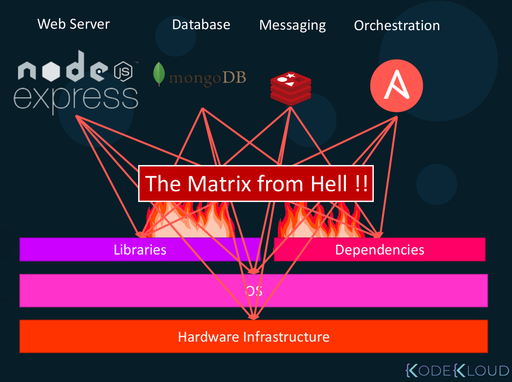
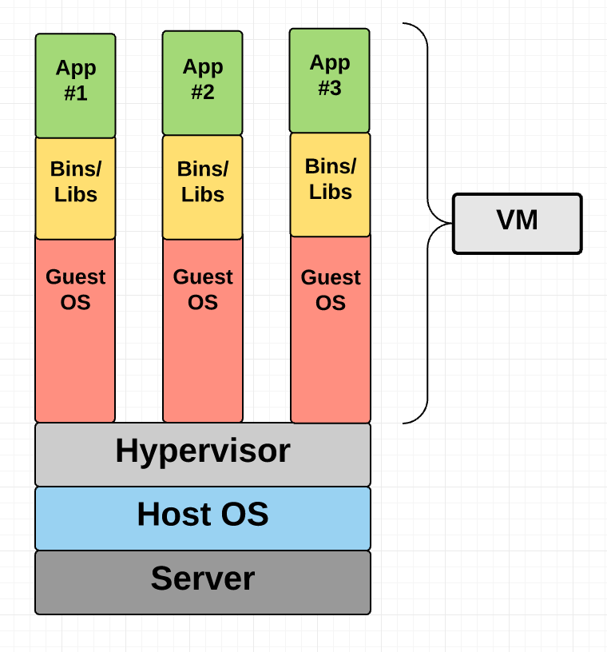
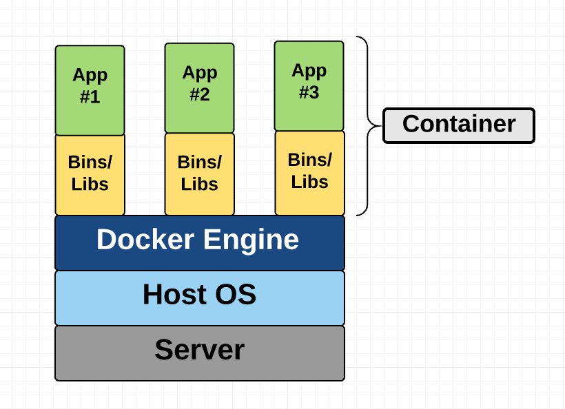
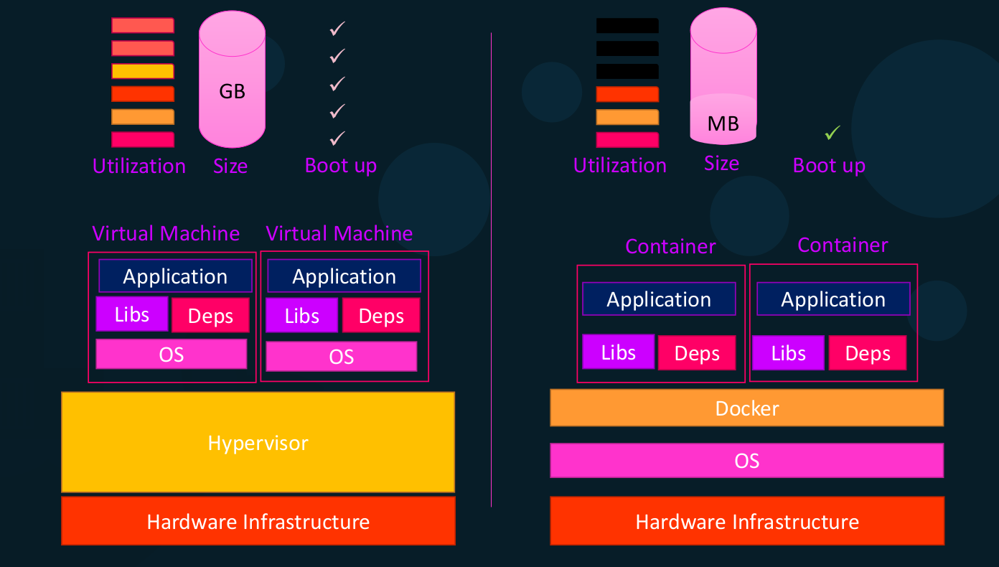
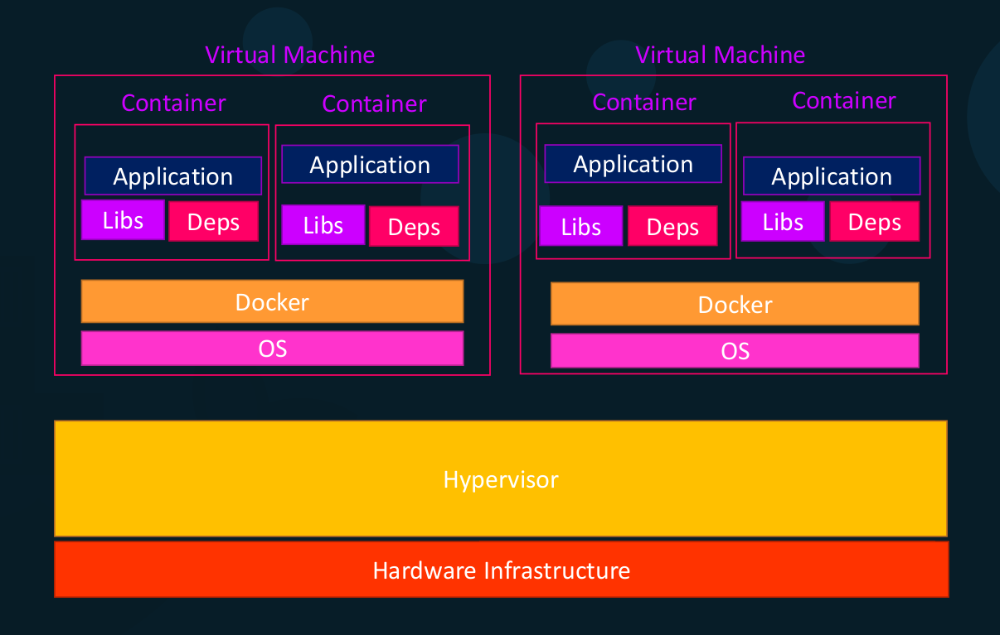
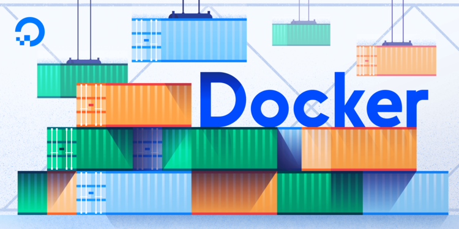

# Docker thường thức - Phần 1: Giới thiệu về Containers, Virtual machines và Docker

Dù bạn là một Kỹ sư phần mềm hay một nhà Khoa học dữ liệu, dù bạn đang lập trình Web hay đang lập trình Mobile,... thì ít nhiều đã nghe nói về Docker. Theo một thống kê của [Stack Overflow](https://insights.stackoverflow.com/survey/2020#technology-most-loved-dreaded-and-wanted-platforms) trong năm 2020; Docker xếp hạng thứ 2 trong số các nền tảng được yêu thích nhất, đồng thời dẫn đầu trong số các nền tảng mà các developers muốn tìm hiểu nhất. Như vậy có thể thấy, Docker đang dần trở thành xu thế tất yếu mà bất kỳ ai tham gia vào ngành công nghiệp công nghệ thông tin cũng nên tìm hiểu, để biết cách sử dụng nó, áp dụng nó, và biến nó trở thành công cụ hữu ích cho các dự án.

Chuỗi bài viết về chủ đề __Docker__ của tôi nhằm mang lại cho người đọc mới bắt đầu tìm hiểu về docker có những cái nhìn tổng quan, cơ bản nhất xung quanh công nghệ đang là __hot trend__ này, từ đó họ có thể dễ dàng chuyển sang các chủ đề chuyên sâu hơn mà phù hợp với dự án của mỗi người.

Trong phần 1, mục đích của bài viết này nhằm mang lại cho bạn đọc các khái niệm cơ bản liên quan đến Docker, chúng sẽ là những thứ mà bạn nhất định phải biết nếu muốn đi sâu vào công nghệ này, ngoài những giải thích bằng lời, tôi cũng cung cấp các hình ảnh trực quan cùng với các ví dụ dễ hiểu.

Công nghệ đến rồi công nghệ đi, nhưng cái nhìn sâu sắc là ở lại trong ta mãi mãi!

## Danh mục nội dung

- [Tại sao lại cần Docker?](#tại-sao-lại-cần-docker)
- [Containers vs Virtual Machines](#containers-vs-virtual-machines)
  - [Virtual machines](#virtual-machines)
  - [Containers](#containers)
  - [Containers vs VMs](#containers-vs-vms)
- [Giới thiệu về Docker](#giới-thiệu-về-docker)
- [Các khái niệm cơ bản](#các-khái-niệm-cơ-bản)
- [Một phép ẩn dụ](#một-phép-ẩn-dụ)
- [Tài liệu tham khảo](#tài-liệu-tham-khảo)
- [Author](#author)
- [Ghi chú](#ghi-chú)

## Tại sao lại cần Docker?

Trước khi đi vào các khái niệm cụ thể, tôi muốn đưa bạn qua một ví dụ để bạn có thể hình dung ra Docker hữu ích như thế nào. Giả sử như bạn đang xây dựng một hệ thống end-to-end với tech stack bao gồm: web server sử dụng NodeJs, database sử dụng MongoDB, messaging system sử dụng Redis, và một orchestration tool.

### Cách tiếp cận truyền thống

Với các cách tiếp cận truyền thống (mà không sử dụng Docker), chúng ta sẽ gặp phải nhiều vấn đề với tech stack nói trên - chúng là các components/services khác nhau trong hệ thống cần xây dựng.

- Đầu tiên là khả năng tương thích (compatibility) với hệ điều hành nền tảng (underlying os), chúng ta phải đảm bảo rằng tất cả các services khác nhau nói trên tương thích với OS mà chúng ta đang sử dụng. Trong trường hợp tồn tại một service trong tech stack đó có version mà chúng ta định sử dụng không tương thích với OS, thì chúng ta lại phải tìm kiếm OS khác tương thích với tất cả các services để phù hợp với nhu cầu của hệ thống ta muốn xây dựng.

- Thứ 2 là chúng ta phải kiểm tra khả năng tương thích giữa các services khác nhau này với các libraries và các dependencies trên OS. Sẽ có vấn đề nếu như một service yêu cầu một phiên bản của dependent library, trong khi đó một service khác lại yêu cầu một phiên bản khác của dependent library đó.

Kiến trúc của hệ thống sẽ thay đổi qua thời gian, chúng ta sẽ phải upgrade lên các phiên bản mới hơn của các thành phần này. Và mỗi lần có một thứ gì đó cần thay đổi, chúng ta lại phải kiểm tra khả năng tương thích của nó với __underlying infrastructure__ (OS, libraries, dependencies,...). Hơn nữa, mỗi khi có một developer mới onboard, chúng ta sẽ gặp khó khăn khi set up môi trường làm việc cho developer đó.



__*Tất cả những vấn đề nói trên dẫn đến việc developing, building và shipping hệ thống gặp nhiều khó khăn.*__

### Cách tiệp cận sử dụng Docker

Như vậy, chúng ta cần một cái gì đó có thể giúp chúng ta giải quyết vấn đề về tính tương thích giữa các thành phần này với OS, chúng ta cũng cần một thứ gì đó có thể giúp chúng ta sửa đổi hoặc thay đổi các thành phần này mà không ảnh hưởng đến các thành phần khác trong hệ thống. Docker đã giải quyết tốt cho chúng ta.


Với Docker, ta có thể chạy mỗi component trong một __container__ riêng biệt với các dependencies và các libraries của riêng nó, tất cả trên một VM (Virtual machine) và một OS nhưng tách biệt môi trường. Chúng ta chỉ phải build cấu hình Docker một lần và các developer có thể bắt đầu với một lệnh __*docker run*__ đơn giản, không phân biệt underlying operating system mà chúng ta đang chạy. Tất cả những cái chúng ta cần là có Docker đã được cài đặt.

## Containers vs Virtual Machines

Cả Containers và Virtual Machines (VMs) đều giống nhau ở mục tiêu, đó là: cô lập môt ứng dụng và các dependencies của nó thành một đơn vị khép kín (self-contained unit) mà có thể chạy ở bất cứ đâu, bất cứ môi trường nào.

Hơn nữa, các Containers và VMs loại bỏ nhu cầu về phần cứng vật lý, cho phép sử dụng hiệu quả hơn các tài nguyên máy tính, cả về tiêu thụ năng lượng và hiệu quả chi phí.

Sự khác biệt chính giữa Containers và VMs là ở cách tiếp cận kiến trúc của chúng.

### Virtual machines

VMs về cơ bản là một sự mô phỏng của một máy tính thực, thực thi các chương trình giống như một máy tính thực.

VMs chạy trên một máy vật lý sử dụng cái gọi là __*hypervisor*__. Một *hypervisor* chạy trên một host machine hoặc trên một __*bare-metal*__.

- Một __*hypervisor*__ là một phần của software, firmware hoặc hardware mà VMs chạy trên đó. Bản thân các *hypervisors* chạy trên một máy tính vật lý, được gọi là __*host machine*__. Host machine cung cấp các tài nguyên cho VMs bao gồm RAM và CPU. Các tài nguyên này được phân chia giữa các VMs và có thể được phân phối khi bạn cảm thấy phù hợp. Vì vậy, nếu một VM đang chạy một ứng dụng cần nhiều tài nguyên hơn thì bạn có thể phân bổ nhiều tài nguyên hơn cho VM đó so với các VM khác đang chạy trên cùng một *host machine*.

- VM đang chạy trên một __*host machine*__ thường được gọi là __*guest machine*__. Guest machine này chứa ứng dụng và cả những thứ khác nó cần để chạy ứng dụng đó. Nó chiếm hữu toàn bộ phần cứng được ảo hóa của riêng nó, bao gồm virtualized network adapters, storage, và CPU,... và nó cũng có một *guest operating system* của riêng nó. Nhìn từ bên trong, *guest machine* hoạt động riêng biệt với các tài nguyên chuyên dụng dành cho nó. Nhìn từ bên ngoài, nó là một máy ảo - chia sẻ tài nguyên được cung cấp bởi *host machine*.

Như đã đề cập ở trên, một guest machine có thể chạy trên một __*hosted hypervisor*__ hoặc trên một __*bare-metal hypervisor*__. Có một vài khác biệt quan trọng giữa chúng:

- Đầu tiên, một *hosted hypervisor* chạy trên OS của một *host machine*. Lấy ví dụ, một máy tính đang chạy OSX có thể có một VM được cài đặt trên OS đó. VM không có quyền truy cập trực tiếp vào hardware, nó phải thông qua OS của host machine. Lợi ích của hosted hypervisor đó là underlying hardware đóng vai trò ít quan trọng. OS của máy chủ chịu trách nhiệm về các hardware drivers thay vì chính hypervisor, và do đó có khả năng tương thích phần cứng tốt. Mặc khác, tầng trung gian này (OS của máy chủ) giữa hardware và hypervisor tạo ra nhiều tài nguyên hơn, làm giảm performance của VM. 

- Một *bare-metal hypervisor* giải quyết vấn đề hiệu năng nói trên bằng cách cài đặt và chạy ngay trên hardware của host machine. Vì nó giao tiếp trực tiếp với phần cứng nên nó không cần OS của máy chủ để chạy. Trong trường hợp này, thứ đầu tiên được cài đặt trên máy chủ đó là hypervisor. Không giống như hosted hypervisor, một bare-metal hypervisor có device drivers của riêng nó và tương tác trực tiếp với từng thành phần cho bất kỳ tác vụ cụ thể nào. Điều này dẫn đến performance, scalability, và stability tốt hơn. Sự đánh đổi ở đây là __*khả năng tương thích phần cứng*__ bị hạn chế bởi vì hypervisor chỉ có thể có rất nhiều device drivers được tích hợp trong đó.

Sau tất cả những gì đã nói về hypervisor, bạn có thể sẽ hỏi rằng tại sao chúng ta lại cần thêm một layer "hypervisor" giữa VM và host machine ? Câu trả lời đó là vì VM có một virtual OS của riêng nó, hypervisor đóng vai trò thiết yếu trong việc cung cấp cho VMs một platform để quản lý để thực thi hệ điều hành khách này. Nó cho phép các host computers chia sẻ tài nguyên của chúng tới các VMs đang chạy với tư cách là guest trên chúng.



Như bạn có thể thấy trên diagram, hypervisor đóng gói virtual hardware, kernel và user space cho mỗi VM mới.

### Containers

Containers có một lịch sử lâu đời trong lĩnh vực điện toán. Không giống như hypervisor virtualization, nơi mà có một hoặc nhiều VMs độc lập chạy ảo trên physical hardware qua một layer trung gian; thay vào đó, containers chạy trong user space ở trên kernel của OS. Do đó, container virtualization thường được gọi là ảo hóa cấp OS. Công nghệ container cho phép nhiều phiên bản user space độc lập được chạy trên một máy chủ duy nhất.

Do trạng thái của chúng là guest của OS, nên các containers đôi khi được xem là kém linh hoạt hơn: chúng thường chỉ có thể chạy cùng hệ điều hành hoặc hệ điều hành khách tương tự trên máy chủ. Lấy ví dụ: bạn có thể chạy Redhat Enterprise Linux trên một máy chủ Ubuntu, nhưng bạn không thể chạy Microsoft Windows trên máy chủ Ubuntu. Containers cũng được coi là kém an toàn hơn so với sự cô lập hoàn toàn của hypervisor virtualization.

Bất chấp những hạn chế này, các containers đã được triển khai dưới nhiều user cases khác nhau. Chúng phổ biến cho việc triển khai __hyperscale__ của các dịch vụ multi-tenant, cho lightweight sandboxing,... bất chấp những lo ngại về bảo mật của chúng.

Các công nghệ container gần đây bao gồm OpenVZ, Solaris Zones và Linux containers như lxc. Sử dụng các công nghệ mới này, containers giờ đây có thể được xem như là một máy chủ hoàn chỉnh theo đúng nghĩa của chúng thay vì chỉ là môi trường thực thi. Trong trường hợp của Docker, vì có các features hiện đại của Linux kernel, như là control group và namespaces --> các containers có sự độc lập mạnh mẽ, network và storage stacks của riêng chúng, cũng như khả năng quản lý tài nguyên để cho phép sự tồn tại thân thiện của nhiều containers trên cùng một máy chủ.

Mặc dù các containers trước đây đã không đạt được large-scale adoption. Một phần lớn của vấn đề này có thể nằm ở độ phức tạp của chúng: các containers có thể phức tạp, khó để set up, khó để quản lý và tự động hóa. __Docker__ nhằm mục đích __thay đổi__ điều đó.



Tóm lại, một khác biệt lớn giữa containers và VMs đó là các containers __*share*__ kernel của máy chủ với các containers khác.

### Containers vs VMs

Dưới đây là một sự so sánh những điểm khác biệt chính giữa VMs và Containers.



Ở bên phải hình trên, trong trường hợp của Docker, ta có underlying hardware infrastructure, OS ở phía trên và Docker được cài đặt trên OS, Docker sau đó quản lý các containers - chúng hoạt động cùng với các libraries và dependencies.

Trong trường hợp của VMs, ở phía bên trái, ta có Hypervisor ở trên hardware và sau đó là VMs ở trên chúng. Và như bạn nhìn thấy, mỗi VMs có OS riêng bên trong nó, sau đó là các libs và deps rồi đến Application --> việc sử dụng các tài nguyên phần cứng trở nên lớn hơn khi có nhiều virtual operation systems đang chạy. VMs cũng tiêu thụ không gian đĩa lớn hơn vì mỗi VM khá nặng - thường lên đến hàng GB, trong khi đó docker containers nhẹ hơn - thường chỉ đến hàng MB --> điều này cho phép Docker container khởi động nhanh hơn - thường chỉ trong vài giây, trong khi đó các VMs sẽ mất khoảng vài phút để khởi động vì nó cần khởi động toàn bộ cả Operation System.

Một điều quan trọng cần lưu ý là Docker có ít sự cô lập (isolation) hơn vì có nhiều tài nguyên được chia sẻ giữa các containers, như Kernel. Trong khi đó, VMs có sự cô lập hoàn toàn với nhau vì chúng không dựa trên underlying os hay kernel.

Mặc dù có sự khác biệt nhất định giữa Container và VM, nhưng sự kết hợp giữa chúng có thể mang lại sự hữu ích nếu biết cách phối hợp chúng hợp lý.



Khi bạn có môi trường lớn với hàng ngàn containers chạy trên hàng ngàn docker host, bạn sẽ thường thấy các containers được cung cấp trên các virtual docker host. Bằng cách này, chúng ta có thể tận dụng được ưu điểm của cả 2 công nghệ, chúng ta có thể sử dụng virtualization để dễ dàng kiểm soát các docker host theo nhu cầu, đồng thời tận dụng Docker để dễ dàng kiểm soát các ứng dụng và scale chúng theo nhu cầu.


## Giới thiệu về Docker

Đến đây thì chắc hẳn nhiều bạn đọc đặt câu hỏi, vậy tóm lại Docker là gì? Tôi sẽ trả lời câu hỏi này ngay sau đây.

Docker là một open-source engine, tự động hóa việc triển khai các ứng dụng vào các containers. Nó được viết bởi một team tại Docker, Inc và được họ phát hành theo giấy phép Apache 2.0.

Vậy Docker có gì đặc biệt? Docker thêm một công cụ triển khai ứng dụng trên môi trường thực thi container đươc ảo hóa. Nó được thiết kế để cung cấp môi trường nhẹ và nhanh chóng để chạy code của bạn, cũng như workflow hiệu quả để đưa code từ laptop --> môi trường test --> môi trường production.

Docker cực kỳ đơn giản. Thật vậy, bạn có thể bắt đầu với Docker trên một máy chủ minimal không chạy gì ngoài một Linux kernel tương thích và một Docker binary. Nhiệm vụ của Docker là cung cấp:

__Một cách dễ dàng và nhẹ nhàng để mô hình hóa thực tế__:

Docker rất nhanh, bạn có thể Dockerize ứng dụng của mình trong vài phút. Docker dựa trên mô hình copy-on-write nên việc thực hiện các thay đổi đối với ứng dụng của bạn cũng cực kỳ nhanh chóng.

__Sự phân chia logic giữa các tác vụ__:

Với Docker, các Developers quan tâm về các ứng dụng của họ chạy trong các containers và các Operations quan tâm đến việc quản lý các containers. Docker được thiết kế để tăng cường tính nhất quán bằng cách đảm bảo môi trường mà các developers viết code khớp với môi trường mà các ứng dụng được triển khai thực tế. Điều này làm giảm rủi ro: "worked in dev, now an ops problem".

__Vòng đời phát triển nhanh và hiệu quả__:

Docker nhằm mục đích giảm thời gian trong chu kỳ giữa code được viết, code được kiểm tra, code được triển khai và được sử dụng. Nó cũng làm cho các ứng dụng của bạn trở nên khả chuyển, dễ để build, và dễ cộng tác.

__Khuyến khích kiến trúc hướng dịch vụ (SOA)__:

Docker cũng khuyến khích các kiến trúc service-oriented và microservices. Docker recommends rằng mỗi container nên chạy một process hoặc một application duy nhất. Điều này thúc đẩy mô hình ứng dụng phân tán, trong đó một ứng dụng hoặc dịch vụ được đại diện bởi một loạt các containers được kết nối với nhau. Điều này giúp dễ dàng distribute, scale, debug và introspect các ứng dụng.

## Các khái niệm cơ bản

Tôi sẽ không nhắc lại khái niệm về VMs và Containers nữa; mà thay vào đó, tôi sẽ đề cập đến 3 khái niệm quan trọng khác mà bạn sẽ gặp thường xuyên khi làm việc với Docker.

__Docker image__:

Docker image giống như các blueprints, chúng là cá immutable master image được sử dụng để tạo ra các containers hoàn toàn giống nhau.

Một docker image chứa Dockerfile, các libraries, và mã nguồn ứng dụng bạn cần chạy, tất cả chúng được bundled lại với nhau.

__Dockerfile__:

Dockerfile là một tệp chứa các lệnh chỉ dẫn cách Docker nên build image của bạn.

Dockerfile đề cập đến một base image, đươc sử dụng để xây dựng initial image layer. Các base images phổ biến như python, ubuntu, redis...

Các layers bổ sung sau đó có thể được xếp chồng lên các base image layers, theo các lệnh chỉ dẫn trong Dockerfile. Ví dụ, một Dockerfile cho một ứng dụng học máy có thể yêu cầu Docker thêm Numpy, Pandas, và Scikit-learn trong một layer trung gian.

Cuối cùng, một *thin layer* có thể được xếp chồng lên trên các layers khác theo Dockerfile code.

__Container Registry__:

Nếu bạn muốn người khác có thể tạo các containers từ image của bạn tạo ra, bạn cần gửi image đó tới một container registry. Docker hub là registry lớn nhất và là mặc định.

## Một phép ẩn dụ

Để khép lại phần 1, tôi đưa ra một phép ẩn dụ để minh họa các khái niệm vừa nói ở trên, bằng cách sử dụng hoạt động Nấu ăn, cụ thể là việc làm một chiếc bánh Pizza.

Khi nấu một món ăn, ta cần có công thức cho món ăn đó, công thức giống như một Dockerfile. Nó cho bạn biết cần phải làm gì để đạt được mục tiêu. Các thành phần của món ăn giống như các layersa, bạn đã có vỏ bánh, nước sốt và pho-mát cho chiếc bánh pizza này.

Hãy nghĩ về công thức và các thành phần được kết hợp lại thành một công cụ làm bánh pizza. Nó giống như Docker image.

Công thức (Dockerfile) cho chúng ta biết những gì chúng ta sẽ làm. Dưới đây là kế hoạch:

- Lớp vỏ được định dạng sẵn và immutable. Nó giống như một basic ubuntu parent image. Đây là bottom layer và được xây dựng đầu tiên.

- Sau đó bạn sẽ thêm một ít pho mát. Thêm second layer này vào bánh pizza giống như cài đặt thêm một thư viện bên ngoài - ví dụ Numpy.

- Sau đó bạn rắc thêm một ít húng quế. Nó giống như mã trong một tệp bạn viết để chạy ứng dụng.

Được rồi, chúng ta hãy bắt đầu nấu ăn:

- Lò nướng bánh pizza giống như Docker platform. Bạn đã lắp đặt lò nướng vào nhà khi chuyển đến để có thể chế biến mọi thứ với nó. Tương tự như vậy, bạn đã cài đặt Docker vào máy tính của mình để có thể "nấu" các containers.

- Bạn khởi động lò nướng bằng cách xoay núm. Lệnh ```Docker run image_name``` giống như núm của bạn - nó tạo và khởi động container của bạn.

- Bánh pizza đã chín giống như một Docker container đang chạy.

- Ăn pizza giống như việc sử dụng ứng dụng.

Giống như làm bánh pizza, tạo một ứng dụng trong một Docker container mất một số công việc, nhưng cuối cùng bạn đã có một thứ tuyệt vời!


*Lời kết: Bài viết đến đây cũng khá dài. Trong Phần 2, tôi sẽ đi sâu vào kiến trúc, các thành phần của Docker, và không phải chờ đợi lâu, ngay trong phần 2 tôi cũng sẽ giúp bạn đọc bắt đầu viết các lệnh đầu tiên với Docker.*

## Tài liệu tham khảo

[1]: *James Turnbull*, The Docker Book (2018)

[2]: *Preethi Kasireddy*, [A Beginner-Friendly Introduction to Containers, VMs and Docker](https://medium.com/free-code-camp/a-beginner-friendly-introduction-to-containers-vms-and-docker-79a9e3e119b) (2016)

[3]: *Jeff Hale*, [Learn Enough Docker to be Useful](https://towardsdatascience.com/learn-enough-docker-to-be-useful-b7ba70caeb4b) (2019)

[4]: *Mumshad Mannambeth*, Docker for the Absolute Beginner - Hands On - DevOps, Section 1 - Docker overview.

## Author

Hà Hữu Linh

linhhh1@fsoft.com.vn

## Ghi chú

Ảnh nền cho bài viết:


